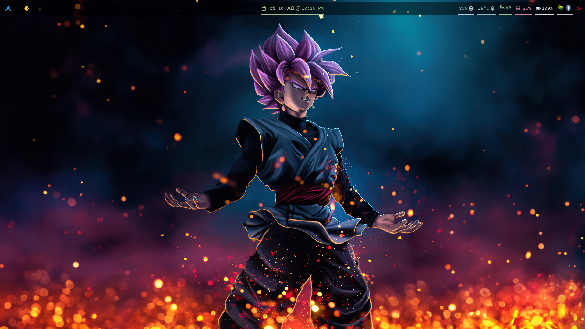
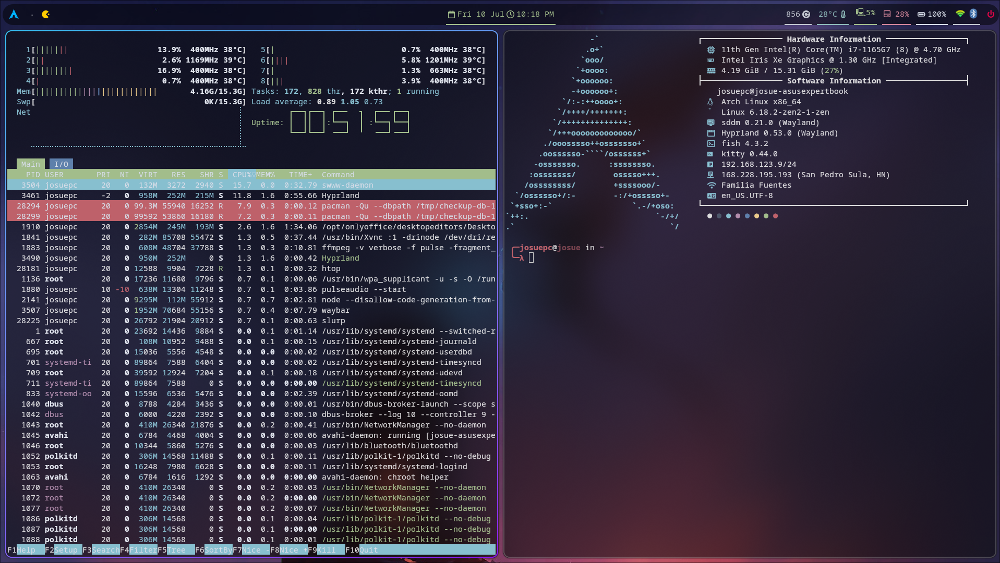
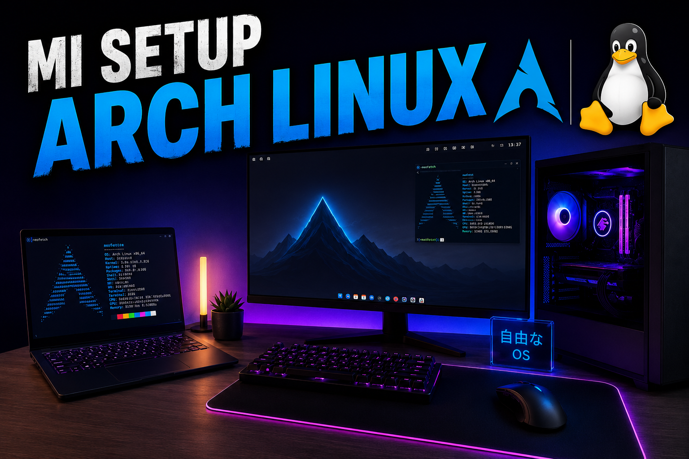

🖌️ Notas de Configuración del Sistema

## Componentes Principales 🏗️

### Hyprland

* **Rol:** Gestor de ventanas (compositor de Wayland)
* **Propósito:** Controla la distribución de ventanas, animaciones y atajos de teclado.
* **Archivo de configuración:** `~/.config/hypr/hyprland.conf`
* **Concepto clave:** Tiling + gestos + transiciones sobre Wayland.

### Waybar

* **Rol:** Barra superior / barra de estado del sistema
* **Propósito:** Muestra workspaces, estadísticas del sistema, reloj, red, etc.
* **Archivos de configuración:**
   * `~/.config/waybar/config`
   * `~/.config/waybar/style.css`
* **Tip:** Usa CSS para animaciones al pasar el mouse (hover) y temas de color.

### Hyprlock 🔒

* **Rol:** Pantalla de bloqueo (lockscreen) de la sesión activa
* **Propósito:** Bloquea la sesión con reloj, fecha y campo de contraseña personalizados.
* **Archivo de configuración:** `~/.config/hypr/hyprlock.conf`
* **Estilo actual:** Paleta cian/azul estilo Arch (coincide con el color de borde activo de Hyprland, `#33ccff`), con feedback visual de `fail_color`/`fail_text` si la contraseña es incorrecta.
* **Nota:** Hyprlock y SDDM son cosas distintas — Hyprlock controla el bloqueo de sesión; SDDM controla la pantalla de inicio de sesión (login). Cambios en uno no afectan al otro.

### swww 🖼️

* **Rol:** Demonio de wallpapers para Wayland
* **Propósito:** Aplica y rota wallpapers con transiciones animadas.
* **Cómo se usa:** `exec-once = swww-daemon` en `hyprland.conf`, junto con un script propio `wallpaper-loop.sh` que rota los fondos automáticamente.
* **Nota:** Anteriormente se usaba `wpaperd` (queda comentado en la config como alternativa desactivada, por si se necesita volver atrás).

## Herramientas de Soporte 🧰

### Kitty

* **Rol:** Emulador de terminal
* **Propósito:** Terminal principal, con renderizado por GPU y transparencia.
* **Archivo de configuración:** `~/.config/kitty/kitty.conf`
* **Tips:**
   * Agregar cursor trail y efectos neón.
   * Ajustar la opacidad con `background_opacity`.

### Fish

* **Rol:** Shell
* **Propósito:** Shell amigable con autosugerencias y resaltado de sintaxis.
* **Archivo de configuración:** `~/.config/fish/config.fish`
* **Nota:** Kitty usa Fish como shell por defecto (`shell fish`).

### Git + GitHub

* **Rol:** Control de versiones para los archivos de configuración.
* **Propósito:** Respaldo y sincronización de `.dotfiles` entre equipos.
* **Carpeta principal:** `~/.dotfiles`
* **Autenticación:** Vía SSH (no HTTPS con token), forzado por el puerto 443 ya que el puerto 22 está bloqueado en la red:

```
# ~/.ssh/config
Host github.com
    HostName ssh.github.com
    Port 443
    User git
    IdentityFile ~/.ssh/id_ed25519_github
```

* **Tip de seguridad:** Nunca generar llaves SSH ni guardar tokens dentro de una carpeta rastreada por Git. Se recomienda un `.gitignore` que excluya archivos de llaves (`*.pub`, `id_ed25519*`, `*.pem`, `*.key`).

### Enlaces Simbólicos (Symlinks)

* **Rol:** Conecta los archivos de configuración reales con tu repositorio rastreado por Git.
* **Propósito:** Mantiene tu `.config` organizado y versionado sin duplicar archivos.
* **Ejemplo:**

```bash
ln -s ~/.dotfiles/hypr ~/.config/hypr
```

## Capturas 📸



[](https://youtu.be/UsZpw_jwruE)